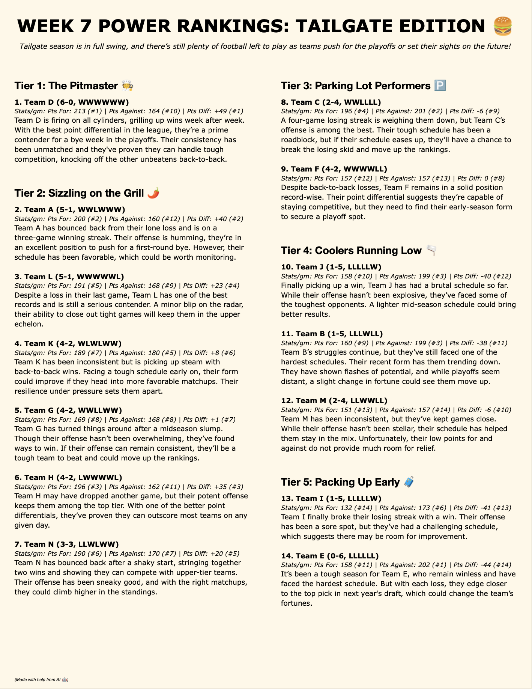
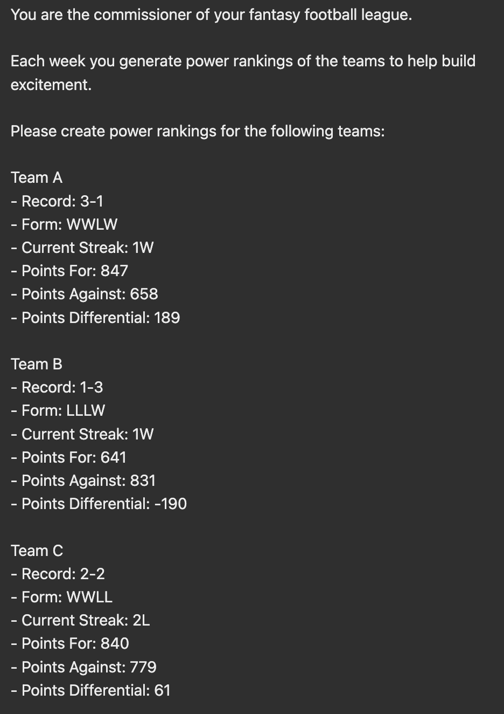
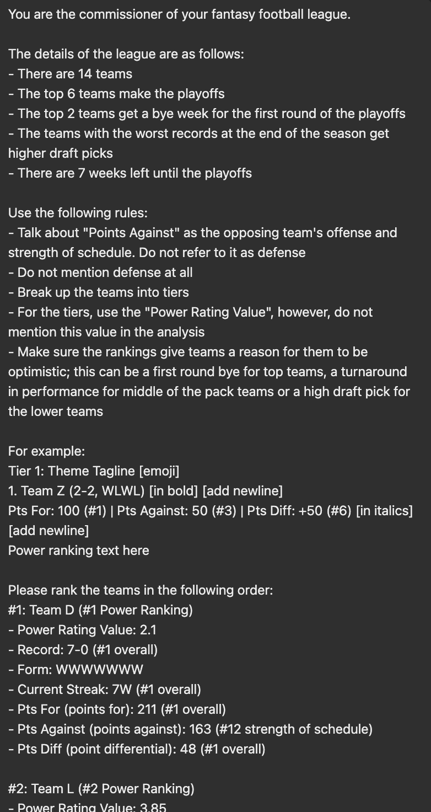
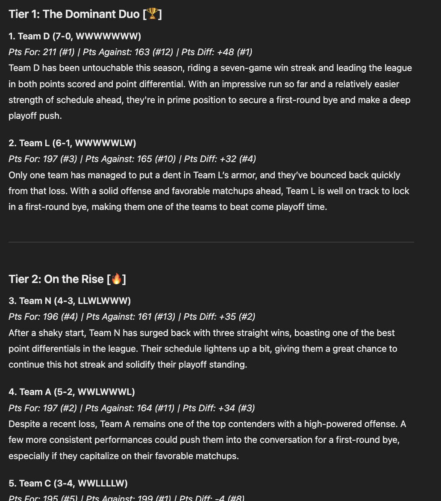
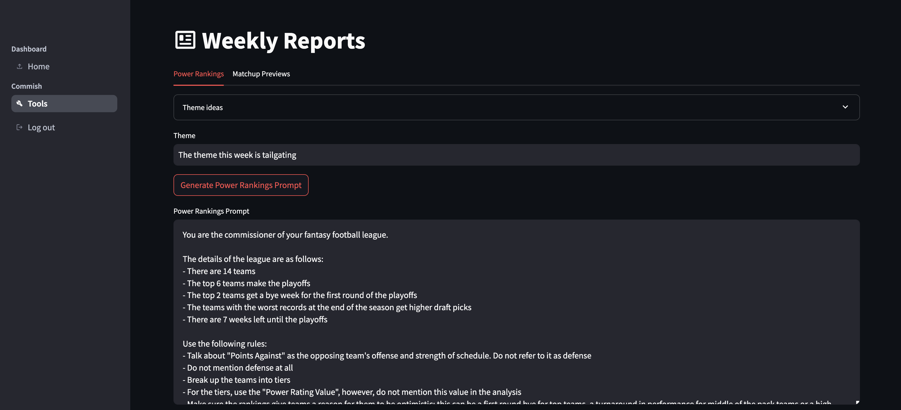

# Overview
As a co-comissioner of one of my fantasy football leagues, we often send out weekly
power rankings of the teams in the league.

Historically, these rankings would be constructed more anecdotally, looking at a team's
overall record and recent performances.

Given that our league had just switched to [Sleeper](https://sleeper.com/), the
[Sleeper API](https://docs.sleeper.com/) seemed like a great way to use more data
for these rankings.

The outcome of this effort was a revised version of these rankings that now uses
Generative AI ("GenAI") and a basic version of Retreival Augmented Generation ("RAG") for prompt engineering,
leveraging data from the Sleeper API to generate the rankings.

The output, after final formatting and review, is shown below (*the teams names are kept anonymous for this post*):

This post will walk through the development process and share some lessons learned.

_Note: This post focuses on creating a web app to automate the prompt engineering process._
_An easy future enhancement would be to pass this prompt to an LLM API programmatically using a tool such as LangChain._

 

# Proof of Concept
To see how feasible this idea was, data was pulled from the Sleeper API to quickly
get information on each team. The data available includes a team's record, form,
points for, points against, along with many other fields.

The first attempt, was successful enough to prove the idea had potential, but some
notable gaps quickly became apparent.

 

### Initial Setup
When exploring this idea, one of the initial concerns was the team names. Players
can name their team anything, and I wanted to avoid the potential for specific entities
(people, players, teams, companies, etc.) being submitted to an LLM (ChatGPT in this case).

The first thought was to use NLP, specially Named Entity Recognition ("NER") using spaCy, to
scrub the team names of any entities. While this approach likely had merit, a simplier idea
came shortly after that made much more sense for the smaller scale of this project.

Maintaining an NER approach would add more complexity than necessary to this system. The
simpler solution was just to replace the team names with a temporary alias before passing
the prompt to ChatGPT.

Initially, team names were replaced with Team 1, Team 2, Team 3, etc., and then programatically switched back after receiving the prompt response. However, since
these are rankings, using numbers introduced the risk of the LLM using that information
in the ranking itself.

Therefore, names such as Team A, Team B, Team C, etc. were ultimately used.
This still presented some risk due to the ordinality, but that was addressed
in a subsequent approach.

 

### Power Rankings Version 1
For the first version of the power rankings, I would collect and organize team names
and stats, and then ChatGPT was asked to power rank the teams.

Below is a preview of the prompt:

A preview of the output of this prompt was:

As we can see, ChatGPT is capable of the task. The rankings are reasonably logical, however
some initial flaws are obvious:

1. _The rankings do not look visibly good_
    - The output formatting follows the input format too heavily, and restates information
    that is either not necessary for the ranking or that is displayed poorly
2. _The rankings essentially just use the overall record_
    - Multiple attempts were made, however, the power rankings were continually just
    sorted by the overall record
3. _Even with some guidance, other information such as Points For was not used effectively_
    - Points For and Points Against are important metrics, as they provide information on the quality
    of a team's offense and their strength of schedule
    - Despite later instructions to use these data points, teams with the same record would often
    still be ordered illogically; a team that is 2-2 with the 3rd best offense and hardest
    strength of schedule should be ranked above another 2-2 team with a poorer offense and
    two lucky wins

Given the challenges above, more improvements were needed.

 
 

# Improved Version
After a bit of trial and error having ChatGPT generate the rankings and text, it became
apparent that it would be much more effective to actually rank the teams myself
using a weighted average of certain key metrics.

 

### RAG
A module was written to pull data from the Sleeper API to get the relevant team statistics.
This data was used to develop the power rankings and to structure and format the prompt
that is passed to ChatGPT.

 

##### Power Rankings
The first version of the power rankings are fairly straightforward. Various stats and
weights were landing on the following weights.

- `30%` - Current Streak
- `25%` - Win Percent
- `25%` - Points For
- `10%` - Points Against
- `10%` - Points Differential

These weights are applied to each team's rank in each metric.

This results in the final power ranking value that is used to order the teams.

 

### Prompt Engineering
Once the rankings are applied, the prompt was reworked significantly. The prompt content
and formatting are all programmitically created using Python and data from the Sleeper API.

Here is the new prompt:

As you can see, this prompt contains numerous changes that improve performance:

- Addition context about the league is provided
- Various rules are provided, specifying how certain metrics should be used
- There is a formatted example of what the response should look like
- The team stats have more information, such as the rank for each stat

 

##### Output Example
As you can see below, this new prompt results in a much better output than before.

 

### Themes
One other addition that was made was the ability to specify a theme. The final output
shown at the beginning shows an example of a "Tailgate" theme.

 

### Streamlit
The current version is a Streamlit app that pulls the data from Sleeper, creates
the rankings, and generates the formatted prompt.

 
 

# Final Touches
In order to generate the final power rankings shown at the beginning of this post,
the results are copy and pasted into a Google Docs template, and the final formatting
touches are applied. At this point, slight changes might be applied as needed, usually
just moving a team between tiers.

 
 

# Lessons Learned
1. `RAG` - _Offload as many decisions as you can_
    - GenAI is great at generating text, not necessarily "crunching numbers"
    - Let the LLM focus on tasks it is suited for, but do not rely on it for
    every part of your system
    - For this project, this meant generating the actual rankings during the RAG process,
    and then just having the LLM format the data and create the accompanying text
    and overall themes
2. `Prompt Engineering` - _Constructing a good input is key_
    - Prompt engineering was just as import as RAG for this project. Providing useful context
    and an example output went a long way in helpful to standardize the output
    - These contraints help narrow the focus of where GenAI can add its value to the system
3. `Human in the loop` - _If possible, some human post-processesing will yield the best results_
    - Ultimately, even with a solid prompt and input data, there is still a level of variance
    - There are many factors that are difficult to quantify; therefore I found the best results
    when I would quick skim the power ranking descriptions and make small edits
    - I would still make judgement calls on moving teams around 1-2 places in the rankings; some factors
    like important players returning from injury are difficult to quantify with the available data, but
    easy to discern as a human
    - This workflow is still much faster than starting from scratch
4. _Formatting alone was very helpful_
    - Just using a RAG approach to provide some data and have it formatted in a specific
    way was suprisingly effective and helpful
