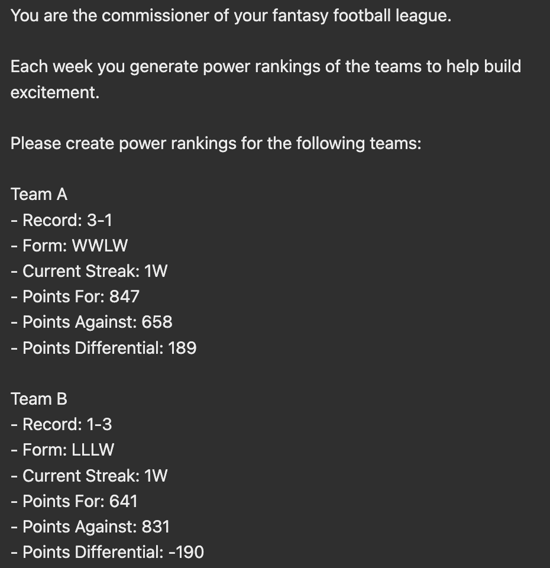
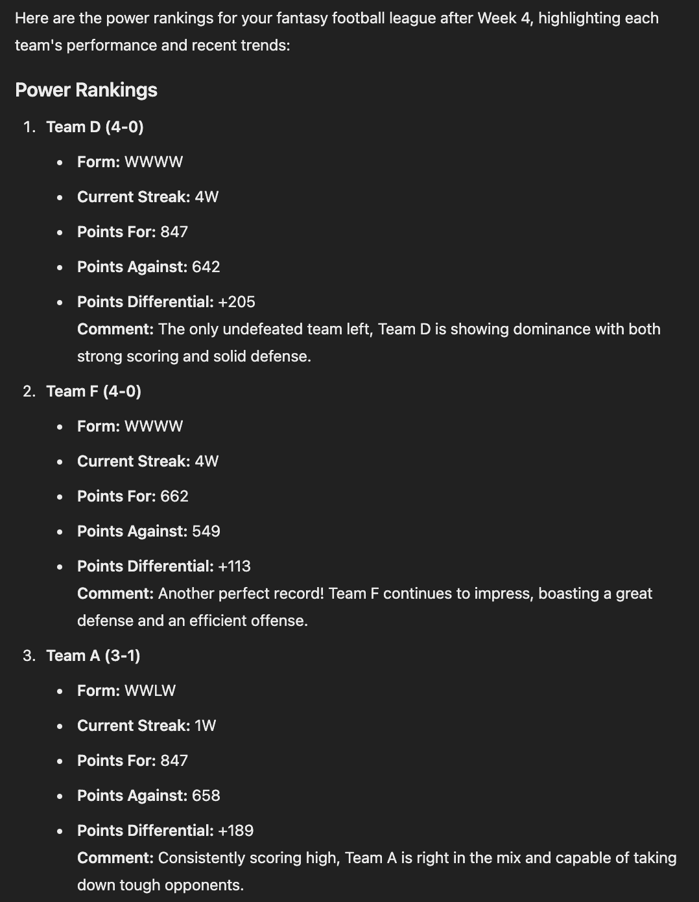

# Overview
As a co-comissioner of one of my fantasy football leagues, we often send out weekly 
power rankings of the teams in the league. 

Historically, these rankings would we be constructed more anecdotally, looking at a team's
overall record and recent performances. 

Given that our league had just switched to [Sleeper](https://sleeper.com/), the
[Sleeper API](https://docs.sleeper.com/) seemed like a great way to use more data
for these rankings.

The revised version of these rankings now uses Generative AI and Retreival Augmented 
Generation, leveraging data from the Sleeper API to generate these rankings. 

This post will walk through the development process and show some lessons learned.

 

# Proof of Concept
To see how feasible this idea was, data was pulled from the Sleeper API to quickly
get information on each team. The data available includes a team's record, form,
points for, points against, along with many other fields. 

The first attempt, was successful enough to prove the idea had potential, but some 
notable gaps quickly became apparent. 

 

## Initial Setup
TODO - Talk about preprocessing of team names into Team 1, 2, etc. and then
Team A, B, etc.
 - Talk about wanting to not use team names
 - Talk about potentially scrubbing names before deciding to just replace them

 

## Version 1
For the first version, the teams and stats were listed out, and Chat GPT was asked
to power rank the teams. 

Below is a preview of the input:

The output of this prompt was:

As we can see, Generative AI is capable of the task. The rankings are reasonably logical, however
some initial flaws are obvious:

1. The rankings do not look visibly good
    - the formatting follows the input format too heavily, and restates information 
    that is either not necessary for the ranking or displays the information poorly
2. The rankings essentially just use the overall record
    - Multiple attempts were tried, however, the power rankings were continually just 
    sorted by the overall record
3. Even with some guidance, other information such as Points For was not used effectively
    - Points For and Points Against are important metrics, as they provide information on the quality 
    of a team's offense and their strength of schedule
    - Despite instructions to use these data points, teams with the same record would often 
    still be ordered illogically

Given the challenges above, more improvements were needed.

 

# Improved Version
## RAG
TODO - talk about further improvements and calculations in the input data 

### Data Collection
TODO

### Power Rankings
TODO

## Prompt Engineering
TODO

## Version 2
TODO

# Interface
## Streamlit
TODO

# Lessons Learned
1. `RAG` - Offload as many decisions as you can
    - Generative AI is great at generating text, not necessarily "crunching numbers"
    - Let generative AI focus on tasks it is suited for, but do not rely on it for 
    every part of your system
    - For this project, this meant generating the actual rankings during the RAG process,
    and then just having generative AI format the data and create the accompanying text 
    and overall themes
2. `Prompt Engineering` - Constructing a good input is key
    - TODO
3. `Zero-Shot vs Multi-Shot` - For this project, the power ranking text was often close 
enough on the first try, however, the tiers would often need multiple attempts to generate
clever and relevant titles across the entire rankings