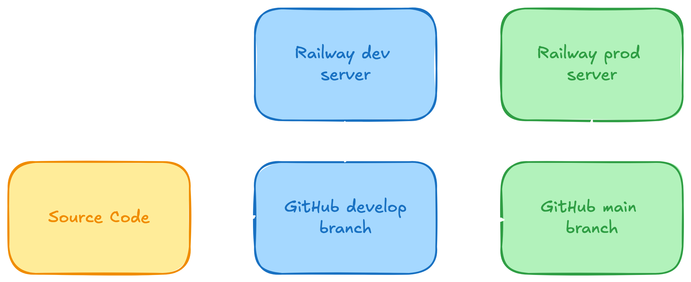

# Overview
The purpose of this site is to have a place to organize and write about other
projects that I have worked on and to brush up on web development.

For this project, the technologies listed were leveraged primarily due to
familiarity with Python and some previous experience with Bootstrap.

 

# Development

This website was initially developed over the course of a weekend. VSCode code
was used for the IDE.

The backend of the site is Python and Flask, with Gunicorn being used when the
site is served in production.

The website code is mostly HTML, CSS, and Bootstrap 5. Jinja templates are used,
mostly to extend base versions of the layout, navigation bar, and footer.

 

# Automated Deployments

For serving the site, automated deployments are set up between Github and Railway.

The site follows semantic versioning. Most changes are tested in the local
environment on a Flask development server.

When a new version is ready for testing, it is merged to the develop branch.
This triggers an automated deployment to a dev server for final testing. The dev
environment is a serverless deployment, so the server will spin up when it gets
a request, and spin down after a short period without any traffic. This setup
ensures that the dev server is available when needed, but that it is not
incurring costs during periods when there is no active development on the site.

Once this testing is complete, a release branch for the new version is created,
the release tag is applied, and the release is merged with the master branch.

When the release is merged into the master branch, it triggers another automated
deployment to push the changes to the production server.

<figure>
  
  <figcaption>Figure 1: Deployment pattern.</figcaption>
</figure>

<!--  -->

 
 

# Sources & Resources Used
- [Railway](http://railway.com/)
- [GitHub](https://github.com/)
- [Excalidraw](https://excalidraw.com/)
