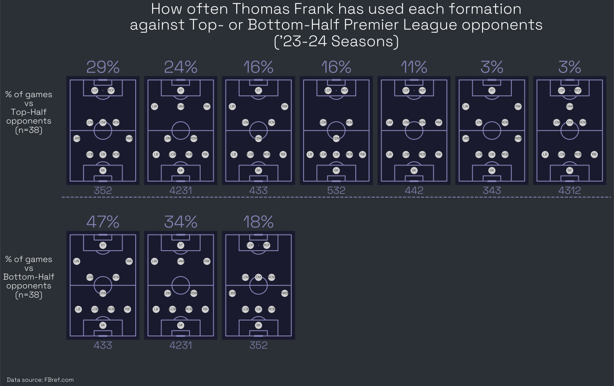

As a [Tottenham Hotspur](https://www.tottenhamhotspur.com/) fan, I found myself wanting to learn more about the tactics of [newly appointed manager Thomas Frank](https://www.tottenhamhotspur.com/news/2025/june/thomas-frank-joins-as-head-coach/). This project is an analysis of how Thomas Frank has set up Brentford during his time as manager in the Premier League.

We'll begin with the analysis itself, and then go into a technical deep dive of how the plots were generated.

<br>

# Analysis

## Formational Variety

The first thing I wanted do for this analysis was to confirm the formational variety for which Thomas Frank is known.

To do this, let's take a quick look at the formations used by Thomas Frank during his time in the Premier League at Brentford.

<div style="position: relative; width: 100%; height: 50vh; background: #2B3036; border-radius:8px;">
  <canvas id="figure1"></canvas>
</div>
<script src='/static/js/thomas_frank_tactics_tottenham/figure1.js'></script>
<figcaption>Figure 1: Thomas Frank Premier League starting formations for the 2021-2024 seasons. (Data source: FBref.com). </figcaption>

Thomas Frank has used a total of 9 formations while in the Premier League, and has used 4 formations at least 15 times.

As a point of comparison, let's look at how Tottenham have set up for the past two seasons under Ange Postecoglou.

<div style="position: relative; width: 100%; height: 50vh; background: #2B3036; border-radius:8px;">
  <canvas id="figure2"></canvas>
</div>
<script src='/static/js/thomas_frank_tactics_tottenham/figure2.js'></script>
<figcaption>Figure 2: Tottenham Premier League starting formations for the 2023-2024 seasons. (Data source: FBref.com).</figcaption>

As we can see, Tottenham have primarily used two similar formations over the previous two seasons.

As one final comparison, let's look at Thomas Frank one more time during that same period.

<div style="position: relative; width: 100%; height: 50vh; background: #2B3036; border-radius:8px;">
  <canvas id="figure3"></canvas>
</div>
<script src='/static/js/thomas_frank_tactics_tottenham/figure3.js'></script>
<figcaption>Figure 3: Thomas Frank Premier League starting formations for the 2023-2024 seasons. (Data source: FBref.com).</figcaption>

Looking at this comparison, it is clear that Frank's style involves more variety in how he chooses to set up his teams. Whether Frank brings this same level of variety (and whether or not it translates as well) to Tottenham remains to be seen.

<br>

## Formations by Opponent Quality
Next, let's take a look at how Opponent Quality factored in to Frank's team set up.

To do this, weekly fixture data was used to determine the current position in the Premier League table for each opponent Thomas Frank faced over the past two seasons. During the first 10 weeks of a new season, the team's final position in the prior season's table was used. For newly promoted teams, a standing of 18th was used for this prior season position. (_We will not be delineating between 18th, 19th, and 20th for this analysis, so there was no need to be more specific._)

First, we'll look at much formational variety Frank employed based on whether the opponent was in the Top 6, Middle 8, or Bottom 6 of the current table when they faced Thomas Frank's Brentford side.

<div style="position: relative; width: 100%; height: 50vh; background: #2B3036; border-radius:8px;">
  <canvas id="figure4"></canvas>
</div>
<script src='/static/js/thomas_frank_tactics_tottenham/figure4.js'></script>
<figcaption>Figure 4: Thomas Frank number of formations used by opponent quality. (Data source: FBref.com).</figcaption>

As Figure 4 shows, Frank started matches in six distinct formations against teams in either the Top 6 or Middle 8, while using only three distinct formations against teams in the Bottom 6. This could indicate that Frank does have a "preferred" style of play that he often chooses, but against teams of potentially higher quality, he decides to deviate from the preferred style. The idea is that Frank would make slight changes to the way his team sets up to better account for an opponent's specific strengths.

We can also see how this looks by just measuring Opponent Quality based on whether a team was in the top or bottom half of the table.

<div style="position: relative; width: 100%; height: 50vh; background: #2B3036; border-radius:8px;">
  <canvas id="figure5"></canvas>
</div>
<script src='/static/js/thomas_frank_tactics_tottenham/figure5.js'></script>
<figcaption>Figure 5: Thomas Frank number of formations used by opponent quality (top or bottom half). (Data source: FBref.com).</figcaption>

Figure 5 shows that this effect is even more pronounced when just looking at whether an opponent is in the top or bottom half of the table when they faced Thomas Frank.

Next, let's see which specific formations Thomas Frank used the most in this matches.

<figure>
  
  <figcaption>Figure 6: Percent of games Thomas Frank started a match in each formation against Top- or Bottom-Half opponents. (Data source: FBref.com).</figcaption>
</figure>

Figure 6 shows that Thomas Frank is happy to set up with four defenders against team's that potentally have less attacking threat, evidenced by the fact that he started games this way 81% of the time against teams in the bottom half of the table. However, against team's in the top half of the table, Thomas Frank set up with a back 4 in just over 50% of those matches.

Looking back, Figure 2 showed Tottenham setting up with only two different formations (both a back 4) for 97% of their matches over the previous two seasons. In only 1 out of 76 total matches over that time did they start in at back 3. Contrasting this Frank's approach, it is fair to see that the Totthenham squad could be in for much more variety in terms of starting formations in the coming season.

<br>

# Technical Deep Dive

## Data Processing

Overall, the data processing portion of this analysis was quite straightforward. Mainly, this analysis was a good excuse to try out some new plotting libraries (Chart.js, mplsoccer).

The only slightly involved portion of data processing was calculating the weekly standings for the Premier League based on weekly fixture data.

After a little data prep, the Polars code below can do the calculation in one go using various window functions.

```python
df

# 1) Sort by season week for rolling sum
.sort(["Season", "Wk"])

# 2) Get the current sum of Points, Goal Difference, and Goals For
.with_columns(
    pl.col("Points")
    .rolling_sum(pl_fixtures_stacked.height, min_samples=1)
    .over(["Season", "Team"], order_by="Date")
    .alias("Points")
)
.with_columns(
    pl.col("GD")
    .rolling_sum(pl_fixtures_stacked.height, min_samples=1)
    .over(["Season", "Team"], order_by="Date")
    .alias("GD")
)
.with_columns(
    pl.col("GF")
    .rolling_sum(pl_fixtures_stacked.height, min_samples=1)
    .over(["Season", "Team"], order_by="Date")
    .alias("GF")
)

# 3) Perform the rank function for each week of the season
.with_columns(
    pl.struct([
        pl.col("Points"),
        pl.col("GD"),
        pl.col("GF")
    ])
    .rank(method="ordinal", descending=True)
    .over(["Season", "Wk"])
    .alias("Season_Wk_Rk")
)

# 4) For the first 10 weeks of the season, use the prior season's final standing
.with_columns(
    pl.when(pl.col("Wk") <= 10)
    .then(pl.col("Prior_Season_Rk"))
    .otherwise(pl.col("Season_Wk_Rk"))
    .alias("Season_Wk_Rk_Adj")
)
```

<br>

## Javascript & Chart.js

Javascript is a great way to make interative plots for a webpage. Below is an example of code for generating the plots above. The code below is specifically for Figure 1.

```javascript
document.addEventListener('DOMContentLoaded', () => {

    Chart.defaults.global.defaultFontFamily = "'Gaegu'";
    Chart.defaults.global.title.display = true;
    Chart.defaults.global.title.fontColor = '#FFF';
    Chart.defaults.global.legend.labels.fontColor = '#FFF';
    Chart.defaults.scale.ticks.fontColor = '#FFF';
    Chart.defaults.scale.scaleLabel.display = true;
    Chart.defaults.scale.scaleLabel.fontColor = '#FFF';


    Chart.plugins.register(ChartRough);
    var fontObserver = new FontFaceObserver('Gaegu');
    fontObserver.load().then(function () {
        function getResponsiveFontSizes() {
            const isMobile = window.innerWidth < 768;
            return {
                title: isMobile ? 18 : 24,
                legend: isMobile ? 12 : 18,
                scaleLabel: isMobile ? 14 : 20,
                ticks: isMobile ? 12 : 18,
            };
        };
        const initialFontSizes = getResponsiveFontSizes();
        const ctx = document.getElementById('figure1').getContext('2d');
        const myChart = new Chart(ctx, {
            type: 'bar',
            data: {
                labels: ['3-5-2','4-3-3','4-2-3-1','5-3-2','4-4-2','4-5-1','Other'],
                datasets: [{
                    label: '# of Matches',
                    data: [53,51,22,16,4,3,3],
                    backgroundColor: '#8787BB',
                    borderColor: '#fff',
                    borderWidth: 1,
                    rough: {
                        roughness: 2,
                        fillStyle: 'hachure',
                        fillWeight: 0.8,
                    }
                }]
            },
            options: {
                maintainAspectRatio: false,
                animation: false,
                onResize: function(chart, size) {
                    const newFontSizes = getResponsiveFontSizes();
                    chart.options.title.fontSize = newFontSizes.title;
                    chart.options.legend.labels.fontSize = newFontSizes.legend;
                    chart.options.scales.yAxes[0].ticks.fontSize = newFontSizes.ticks;
                    chart.options.scales.xAxes[0].ticks.fontSize = newFontSizes.ticks;
                    chart.options.scales.yAxes[0].scaleLabel.fontSize = newFontSizes.scaleLabel;
                    chart.options.scales.xAxes[0].scaleLabel.fontSize = newFontSizes.scaleLabel;
                },
                scales: {
                    yAxes: [{
                        ticks: {
                            beginAtZero: true,
                            fontSize: initialFontSizes.ticks
                        },
                        scaleLabel: {
                            labelString: '# of Matches',
                            fontSize: initialFontSizes.scaleLabel
                        }
                    }],
                    xAxes: [{
                        ticks: {
                            beginAtZero: true,
                            fontSize: initialFontSizes.ticks
                        },
                        scaleLabel: {
                            labelString: 'Starting Formation',
                            fontSize: initialFontSizes.scaleLabel
                        }
                    }],
                },
                legend: {
                    labels: {
                        fontColor: '#fff',
                        fontSize: initialFontSizes.legend
                    }
                },
                title: {
                    text: ["Thomas Frank Formations", "('21-24 Seasons)"],
                    fontSize: initialFontSizes.title
                },
            }
        });
    });
});
```

<br>

## mlpsoccer

mlpsoccer is a wrapper on top of matplot and integrates very well with a python workflow. Once the data is organized with opponent position added to a team's fixture data with formations, the python code below will generate the plot used for Figure 6 above.


```python
df = (
    tf_formations_by_opponent_quality
    .group_by(["Opponent_Top_Bottom_Half", "Formation"]).agg(
        pl.len().alias("Matches"),
    )
    .with_columns(
        (pl.col("Matches") / pl.col("Matches").sum().over("Opponent_Top_Bottom_Half")).round(2).alias("Pct_of_Total")
    )
    .sort(
        by=["Opponent_Top_Bottom_Half", "Matches"],
        descending=[False, True]
    )
)

opponent_groups = ["Top Half", "Bottom Half"]
opponent_group_labels = ["Top\nHalf", "Bottom\nHalf"]

fig, ax = plt.subplots(2, 7, figsize=(18,12))
fig.patch.set_facecolor('#2B3036')
fig.subplots_adjust(hspace=1.0)

for opponent_idx, opponent in enumerate(opponent_groups):
    formations = df.filter(pl.col("Opponent_Top_Bottom_Half") == opponent)["Formation"].to_list()
    formations = [x.replace("-", "") for x in formations]
    pct_of_totals = df.filter(pl.col("Opponent_Top_Bottom_Half") == opponent)["Pct_of_Total"].to_list()
    pct_of_totals = [f"{x * 100:.0f}%" for x in pct_of_totals]

    for formation_idx, formation in enumerate(formations):
        pitch = mpls.VerticalPitch(
            'uefa',
            pitch_color = '#1a1a2e',
            line_color = '#8787BB',
        )
        pitch.draw(ax=ax[opponent_idx][formation_idx])
        positions = pitch.formations_dataframe.loc[pitch.formations_dataframe.formation == formation, 'name']
        pitch.formation(
            formation,
            kind='scatter',
            ax=ax[opponent_idx][formation_idx],
            positions=positions,
            color='lightgrey',
            s=250,
        )
        pitch.formation(
            formation,
            kind='text',
            ax=ax[opponent_idx][formation_idx],
            positions=positions,
            text=positions,
            color='black',
            fontsize=8, fontweight=900, ha='center', va='center'
        )
        ax[opponent_idx][formation_idx].set_title(
            pct_of_totals[formation_idx],
            color='#8787BB',
            fontsize=40,
            fontweight=900
        )
        ax[opponent_idx][formation_idx].text(
            0.5, -.1, formation,
            color='#8787BB',
            fontsize=24,
            fontweight='bold',
            transform=ax[opponent_idx][formation_idx].transAxes,
            ha='center', va='bottom',
        )

for a in ax.flat:
    has_content = any(len(item) > 0 for item in [a.lines, a.patches, a.collections, a.images, a.texts, a.tables])
    if not has_content:
        a.axis('off')

# add row lables
fig.text(-.06, .68, s="% of games\nvs\nTop-Half\nopponents\n(n=38)",
    ha='center', va='center', fontsize=20, fontweight='bold', color='#fff'
)
fig.text(-.06, .23, s="% of games\nvs\nBottom-Half\nopponents\n(n=38)",
    ha='center', va='center', fontsize=20, fontweight='bold', color='#fff'
)

# add divider line
line_y_position = 0.45
line = lines.Line2D([0, 1], [line_y_position, line_y_position],
                    transform=fig.transFigure,
                    color='#8787BB',
                    linewidth=2, linestyle='--')
fig.add_artist(line)

fig.suptitle(
    "How often Thomas Frank has used each formation\nagainst Top- or Bottom-Half Premier League opponents",
    color='#fff',
    fontsize=36,
    fontweight=900,
)

plt.tight_layout()
plt.show()
```


<br><br>

# Sources & Resources
- All data is from Sports Reference ([FBref.com](https://fbref.com/))
- [How to Make Graphs Like The Athletic in Python](https://www.youtube.com/watch?v=v3uI44ZA_WU) by McKay Johns for pitch plot inspiration
- The Athletic (original inspriration for the previous video)
- [Chart.js](https://www.chartjs.org/)
- [chartjs-plugin-rough](https://github.com/nagix/chartjs-plugin-rough)
- [roughViz.js](https://www.jwilber.me/roughviz/) for inspiration for the Chart.js styling
- [mplsoccer](https://github.com/andrewRowlinson/mplsoccer) by Andrew Rowlinson
